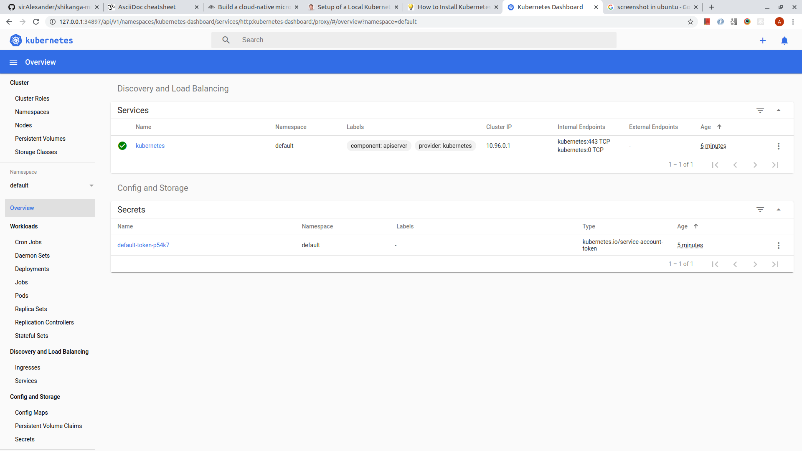

=== Eclipse MicroProfile

Optimizing Enterprise Java for a Microservices Architecture

=== Setup of a Local Kubernetes and Istio Dev Environment

In order to build cloud-native applications and microservices, it’s very convenient to have a local https://kubernetes.io/[Kubernetes] cluster and https://istio.io/[Istio] running locally. This article describes how to install these components and some additional tools like https://www.kiali.io/[Kiali].

==== Minikube

I’ve chosen is https://kubernetes.io/docs/setup/minikube/[Minikube] which runs a single-node Kubernetes cluster inside a VM on your development machine.

===== Install and Set Up kubectl on Ubuntu

I highly recommend using `snap package manager`, kubectl is available as a snap application.
----
snap install kubectl --classic

kubectl version
----

===== Install MiniKube

One first needs to check if virtualization is supported on their Linux distro. Run the following command and verify that the output is non-empty:
----
$ grep -E --color 'vmx|svm' /proc/cpuinfo
----

Verify that `kubectl` was installed correctly
----
$ kubectl version -o json
----

You should see similar output:
----
{
  "clientVersion": {
    "major": "1",
    "minor": "17",
    "gitVersion": "v1.17.0",
    "gitCommit": "70132b0f130acc0bed193d9ba59dd186f0e634cf",
    "gitTreeState": "clean",
    "buildDate": "2019-12-10T03:03:57Z",
    "goVersion": "go1.13.5",
    "compiler": "gc",
    "platform": "linux/amd64"
  }
}
----

====== Install a Hypervisor
* Update your system with the latest version. You can do this by running the following commands:
----
$ sudo apt-get update -y
$ sudo apt-get upgrade -y
----
* Next, install some required packages with the following command:
----
$ sudo apt-get install curl wget apt-transport-https -y
----
* Follow the process below to install latest version of VirtualBox.

** Add Oracle VirtualBox’s repository to your list of repositories. You add its GPG key so that your system trusts this repository. Now when you install VirtualBox, it will be installed from Oracle’s repository instead of Ubuntu’s repository. If there is a new version released, VirtualBox install will be updated along with the system updates.

*** First, add the key for the repository, using the following command:
----
$ wget -q https://www.virtualbox.org/download/oracle_vbox_2016.asc -O- | sudo apt-key add -
----

** Now add the Oracle VirtualBox repository to the list of repositories using this command:
----
$ sudo add-apt-repository "deb [arch=amd64] http://download.virtualbox.org/virtualbox/debian $(lsb_release -cs) contrib"
----

** Type `sudo apt install virtualbox–` and hit tab to see the various VirtualBox versions available for installation and then select one of them by typing it completely.
----
$ sudo apt update && sudo apt install virtualbox-6.1
----

** Use the command below if you need to `remove` VirtualBox from Ubuntu
----
$ sudo apt remove virtualbox virtualbox-*
----

===== Completion of MiniKube Installation
* Download the latest version of `Minikube` to your system. You can download it from their official websites with the following command:
----
 $ wget https://storage.googleapis.com/minikube/releases/latest/minikube-linux-amd64
----
* Once the download is completed, copy the downloaded file under /usr/local/bin with the following command:
----
$ cp minikube-linux-amd64 /usr/local/bin/minikube
----
* Next, give execution permission to the minikube with the following command:
----
$ chmod 755 /usr/local/bin/minikube
----
* Next, check the version of Minikube with the following command:
----
$ minikube version
----
* You should get the following output:
----
minikube version: v1.6.2
commit: 54f28ac5d3a815d1196cd5d57d707439ee4bb392
----

==== Start Minikube
*Note:* As I'll be running `Istio` along with my applications, one needs more memory and CPU than you get by default. Here are some recommended settings:
----
$ minikube config set cpus 4
$ minikube config set memory 8192
$ minikube config set disk-size 50g
$ minikube addons enable ingress
----

With all the required packages are installed. You can now start Minikube with the following command:
----
$ minikube start
----

This will download the Virtualbox image and configure Kubernetes cluster as shown below:
----
😄  minikube v1.6.2 on Ubuntu 18.04
✨  Automatically selected the 'virtualbox' driver (alternates: [none])
💿  Downloading VM boot image ...
    > minikube-v1.6.0.iso.sha256: 65 B / 65 B [--------------] 100.00% ? p/s 0s
    > minikube-v1.6.0.iso: 150.93 MiB / 150.93 MiB [-] 100.00% 19.41 MiB p/s 8s
🔥  Creating virtualbox VM (CPUs=2, Memory=2000MB, Disk=20000MB) ...
🐳  Preparing Kubernetes v1.17.0 on Docker '19.03.5' ...
💾  Downloading kubeadm v1.17.0
💾  Downloading kubelet v1.17.0
🚜  Pulling images ...
🚀  Launching Kubernetes ...
⌛  Waiting for cluster to come online ...
🏄  Done! kubectl is now configured to use "minikube"
----

==== Verifying cluster status and kubectl configuration

You can now check the cluster status with the following command:
----
$ kubectl cluster-info
----

You should get the following output:
----
Kubernetes master is running at https://192.168.99.100:8443
KubeDNS is running at https://192.168.99.100:8443/api/v1/namespaces/kube-system/services/kube-dns:dns/proxy

To further debug and diagnose cluster problems, use 'kubectl cluster-info dump'.
----

You can also check the Kubectl default configuration with the following command:
----
$ kubectl config view
----

Below is the expected output:
----
apiVersion: v1
clusters:
- cluster:
    certificate-authority: /home/sir_alexander/.minikube/ca.crt
    server: https://192.168.99.100:8443
  name: minikube
contexts:
- context:
    cluster: minikube
    user: minikube
  name: minikube
current-context: minikube
kind: Config
preferences: {}
users:
- name: minikube
  user:
    client-certificate: /home/sir_alexander/.minikube/client.crt
    client-key: /home/sir_alexander/.minikube/client.key
----

To check the running nodes, run the following command:
----
$ kubectl get nodes
----

output:
----
NAME       STATUS   ROLES    AGE   VERSION
minikube   Ready    master   16m   v1.17.0
----

You can check the status of Minikube with the following command:
----
$ minikube status
----
And see the following output:
----
host: Running
kubelet: Running
apiserver: Running
kubeconfig: Configured
----

You can also access the Minikube Virtualbox with the following command:
----
$ minikube ssh
----
and get:
----
                         _             _
            _         _ ( )           ( )
  ___ ___  (_)  ___  (_)| |/')  _   _ | |_      __
/' _ ` _ `\| |/' _ `\| || , <  ( ) ( )| '_`\  /'__`\
| ( ) ( ) || || ( ) || || |\`\ | (_) || |_) )(  ___/
(_) (_) (_)(_)(_) (_)(_)(_) (_)`\___/'(_,__/'`\____)

$
----

Now, exit from the Virtualbox shell:
----
$ exit
----

You can also stop and delete kubernetes cluster anytime with the following command:
----
$ minikube stop
$ minikube delete
----

==== Access Kubernetes Dashboard
By default, Kubernetes comes with web dashboard that can be used to manage your cluster.
You can list all the minikube addons with the following command:

----
$ minikube addons list
----

You should see the following output:
----
- addon-manager: enabled
- dashboard: disabled
- default-storageclass: enabled
- efk: disabled
- freshpod: disabled
- gvisor: disabled
- helm-tiller: disabled
- ingress: disabled
- ingress-dns: disabled
- logviewer: disabled
- metrics-server: disabled
- nvidia-driver-installer: disabled
- nvidia-gpu-device-plugin: disabled
- registry: disabled
- registry-creds: disabled
- storage-provisioner: enabled
- storage-provisioner-gluster: disabled
----

Next, list all the container image running in the cluster with the following command:
----
kubectl get pods --all-namespaces
----

You should see the following output:
----
NAMESPACE     NAME                                        READY   STATUS    RESTARTS   AGE
kube-system   coredns-6955765f44-pjzdd                    1/1     Running   0          42s
kube-system   coredns-6955765f44-q7zcd                    1/1     Running   0          42s
kube-system   etcd-minikube                               1/1     Running   0          48s
kube-system   kube-addon-manager-minikube                 1/1     Running   0          48s
kube-system   kube-apiserver-minikube                     1/1     Running   0          48s
kube-system   kube-controller-manager-minikube            1/1     Running   0          48s
kube-system   kube-proxy-2lvq8                            1/1     Running   0          42s
kube-system   kube-scheduler-minikube                     1/1     Running   0          47s
kube-system   nginx-ingress-controller-6fc5bcc8c9-4pnnn   1/1     Running   0          40s
kube-system   storage-provisioner                         1/1     Running   0          41s
----

Now, run the following command to get the URL of the kubernetes dashboard:
----
minikube dashboard --url
----

You should see the following output:
----
🔌  Enabling dashboard ...
🤔  Verifying dashboard health ...
🚀  Launching proxy ...
🤔  Verifying proxy health ...
http://127.0.0.1:34897/api/v1/namespaces/kubernetes-dashboard/services/http:kubernetes-dashboard:/proxy/
----

Your Minikube web url is now generated. Next, open your web browser and type the URL `http://127.0.0.1:34897/api/v1/namespaces/kubernetes-dashboard/services/http:kubernetes-dashboard:/proxy/`. You will be redirected to the Kubernetes dashboard as shown in the following page:

You can now easily manage your Kubernetes cluster through your web browser.